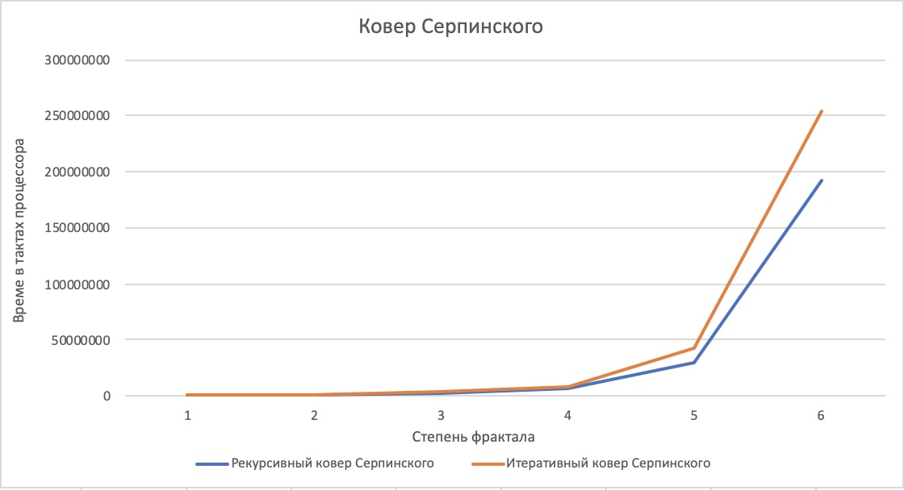
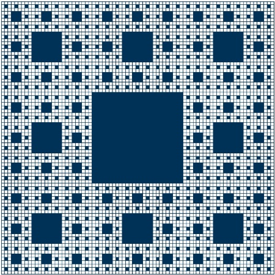
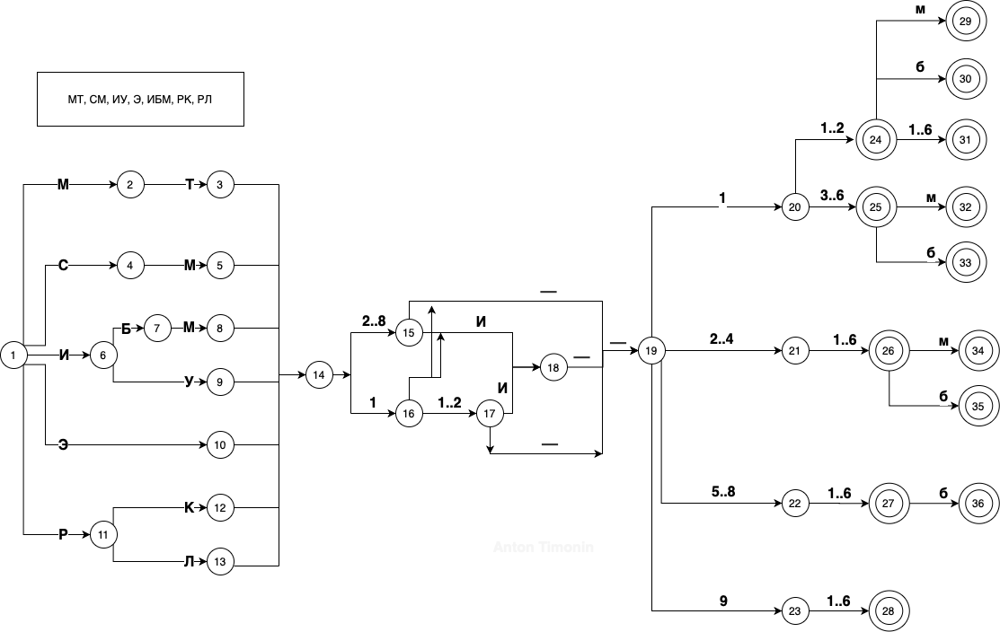
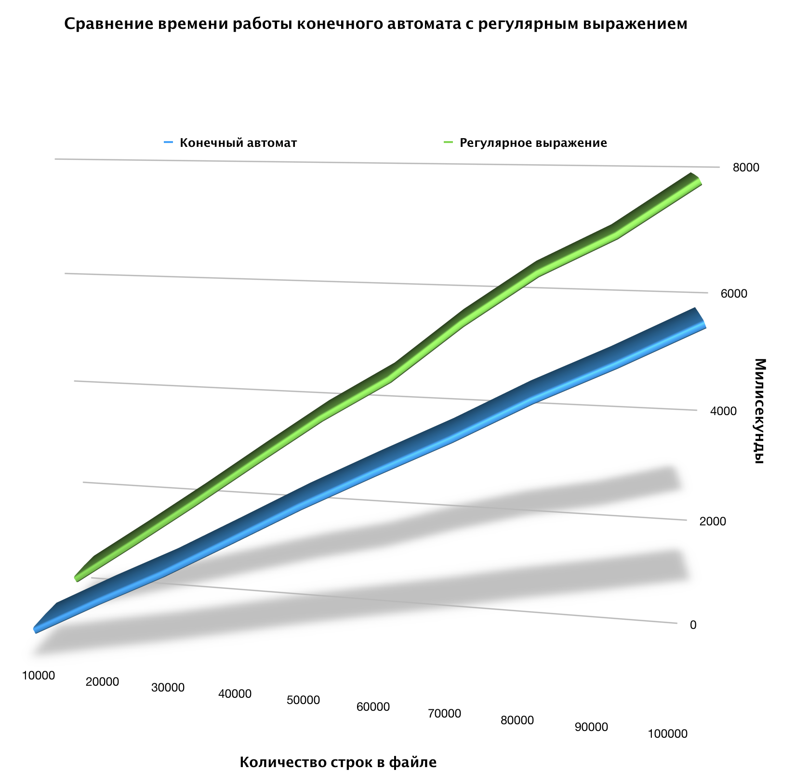

# Анализ алгоритмов; МГТУ; 5 семестр :shipit:

## Лабораторные работы

| :1234: | Описание | Состояние |
| --- | --- | --- |
| :one: | Расстояние Левенштейшна, Дамерау-Левенштейна | :white_check_mark: |
| :two: | Классический алгоритм перемножения матриц, алгоритм Винограда | :white_check_mark: | 
| :three: | Сортировка пузырьком, вставками, выбором | :white_check_mark: |
| :four: | Многопоточная реализация алгоритма Винограда для п-я матриц | :white_check_mark: |
| :five: | Многопоточный конвейер | :white_check_mark: |
| :six: | Поиск крадчайшего пути при помощи муравьиного алгоритма | :negative_squared_cross_mark: |
| :seven: | Поиск подстроки в строке. Алгоритм Кнута-Морриса-Пратта, Бойера-Мура | :white_check_mark: |

## Рубежные контроли

| :1234: | Описание | Состояние |
| --- | --- | --- |
| :one: | Фрактал: ковер Серпинского | :white_check_mark: |
| :two: | Конечный автомат, регулярное выражение | :white_check_mark: | 


## Фракталы. Рубежный контроль 1


*Фракталы вокруг нас повсюду, и в очертаниях гор, и в извилистой линии морского берега. Некоторые из фракталов непрерывно меняются, подобно движущимся облакам или мерцающему пламени, в то время как другие, подобно деревьям или нашим сосудистым системам, сохраняют структуру, приобретенную в процессе эволюции.*
Х. О. Пайген и П. Х. Рихтер.

**Задача: Ковёр Серпинского (Фрактальный)**

Ковёр Серпинского (квадрат Серпинского) — фрактал, один из двумерных аналогов множества Кантора, предложенный польским математиком Вацлавом Серпинским.

Ниже представлен рисунок, на котором изображены фракталы ковра Серпинского с степнями от 1 до 5


                                         Рис. 1 Ковер Серпинского


**Как строится ковер Серпинского**

Вычислим площадь ковра Серпинского, считая исходный квадрат единичным. Для этого достаточно вычислить площадь вырезаемых квадратов. На первом шаге вырезается квадрат площади  1/9. На втором шаге вырезается восемь квадратов, каждый из которых имеет площадь  1/81.
На каждом следующем шаге число вырезаемых квадратов увеличивается в восемь раз, а площадь каждого из них уменьшается в девять раз. Таким образом, общая площадь вырезаемых квадратов представляет собой сумму геометрической прогрессий с начальным членом  1/9 и знаменателем  8/9. По формуле суммы геометрической прогрессии находим, что это число равно единице, т. е. площадь ковра Серпинского равна нулю.


```C++
void frac(point p1, point p2, power n)
//Вычисление новых координат для фрактала
    x1_new = 2 * x1 / 3 + x2 / 3;
    x2_new = x1 / 3 + 2 * x2 / 3;
    y1_new = 2 * y1 / 3 + y2 / 3;
    y2_new = y2 / 3 + 2 * y2 / 3;
//Запуск рекурсивной функции
  frac({x1, y1}, {x1_new, y1_new}, n-1);
  .
  .
  .
  .
  frac({x2_new, y2_new}, {x2, y2}, n-1);
//Приведен код, для поняснения происходящего
```

В действительности рекурсивная реализация фрактала выглядит следуюзим образом:
```C++
void paintwidget::kov(QPainter &painter, double A, double B, double C, double D, int n)
{
    if (delay) {
        QTime end = QTime::currentTime().addMSecs(1);
        while(QTime::currentTime() < end)
            QCoreApplication::processEvents(QEventLoop::AllEvents, 1000);
        repaint();
    }

    draw_rect(painter, A, B, C, D);

    double A1, B1, C1, D1;
           if(n > 0) {
              A1 = 2 * A / 3 + C / 3;
              C1 = A / 3 + 2 * C / 3;
              B1 = 2 * B / 3 + D / 3;
              D1 = B / 3 + 2 * D / 3;

              int x1 = A1, y1 = B1, x2 = C1, y2 = D1;
              //painter.drawRect(A1, B1, C1, D1);


              int miny = std::min(y1, y2);
              int maxy = std::max(y1, y2);

              for (int i = miny; i < maxy; i++) {
                  painter.drawLine(x1, i, x2, i);
              }

              kov(painter, A, B, A1, B1, n-1);
              kov(painter, A1, B, C1, B1, n-1);
              kov(painter, C1, B, C, B1, n-1);
              kov(painter, A, B1, A1, D1, n-1);
              kov(painter, C1, B1, C, D1, n-1);
              kov(painter, A, D1, A1, D, n-1);
              kov(painter, A1, D1, C1, D, n-1);
              kov(painter, C1, D1, C, D, n-1);
           }
}
```

Итеративную реализацию ковра Серпинского можно посмотреть ```/fractal_Sierpinski/paintwidget.cpp```

**Анализ двух реализаций алгоритма построения фрактала Ковер Серпинского**

Ниже приведен график зависимости степени фрактала от времени в тактач процессора, для рекурсивной и итеративной реализации алгоритма.



Из графика видно, что рекурсивная реализация алгоритма построения фрактала быстрее итеративной. Скорее всего, это связано с тем, что отрисовка пикселей не сильно нагружает процессор, поэтому вызов рукурсивной отрисовки "ковров" происходит быстрей, в отличие от заноса в стек и отрисовки.

**Картинки фракталов(без подписей)**



                                         Рис. 2 Фрактал с степенью 4


                                         Рис. 3 Фрактал с степенью 5

**Программа**

Готовую, рабочую программу можно посмотреть здесь →[Ковер Серпинского](https://github.com/dotruger37/analysis_algorithms/tree/master/fractal_Sierpinski)

Ковер Серпинского, Ковёр Серпинского, Квадрат Серпинского

## Конечные автоматы и регулярные выражения. Рубежный контроль 2






